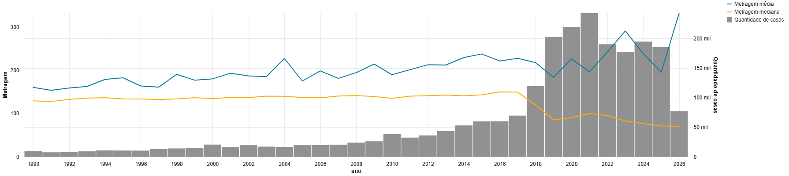
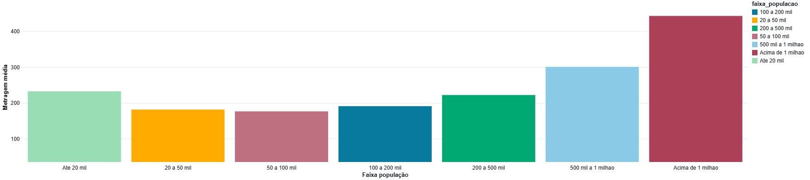
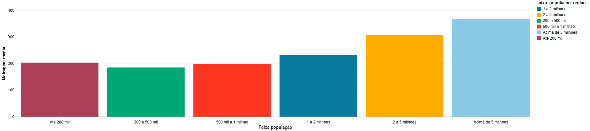
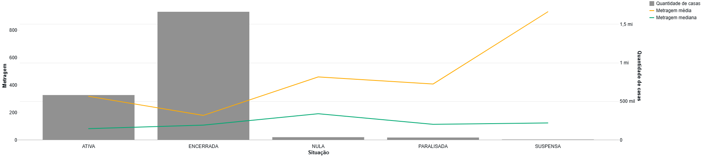
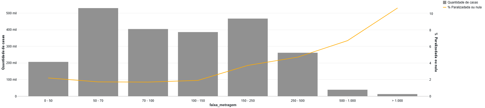

# Análise de Dados

> Documento principal do tópico **"Análise de Dados"** — respostas às perguntas do objetivo com discussão.
> Consultas e execução: [`analise/cadastro_nacional_obras.ipynb`](../../analise/cadastro_nacional_obras.ipynb).
> Universo analítico e decisões: [Definições operacionais](../contexto-e-perguntas/definicoes.md).

---

## Universo analítico

Casas = áreas **Principal** com `destinacao` em (`Residencial unifamiliar`, `Casa popular`), `categoria` em (`Existente`, `Obra Nova`); métrica = `metragem` (m²). População pareada **no ano da obra**.

---

## P1 — Houve variação no tempo da área média das casas?

**Resposta: não conclusiva** (ver [perguntas.md](../contexto-e-perguntas/perguntas.md)).

Até 2018 há crescimento moderado da metragem média com mediana estável. A partir de 2019 ocorre mudança estrutural na série, simultânea ao forte aumento de registros (o CNO substituiu o CEI e incorporou registros do cadastro anterior), alterando a composição e cobertura da base. Além disso, a possível **sub-representação de residências ≤ 70 m²** (dispensa legal) pode elevar a média observada. A diferença entre média e mediana indica forte assimetria, tornando a média sensível a obras muito grandes.

**Conclusão:** com base no CNO, não é possível afirmar que o tamanho das casas aumentou ou diminuiu ao longo do tempo.

## P2 — O tamanho populacional do município (e da região geográfica imediata) se relaciona com a área construída?

**Resposta: há associação, sem causalidade.**

Observou-se aumento da metragem média das casas nas **Regiões Geográficas Imediatas mais populosas** (especialmente acima de 1 milhão de habitantes) — não evidenciando a relação inversa que se esperaria se adensamento/custo do terreno fossem os fatores dominantes. A relação não é uniforme nas faixas menores e, por se tratar de análise agregada, **não é possível estabelecer causalidade**.

## P3 — Distribuição das situações por porte: obras menores têm mais chance de ficarem paralisadas/nulas?

**Resposta: hipótese refutada para a base registrada.**

A proporção de obras `PARALISADA`/`NULA` **aumenta com a metragem** (especialmente acima de 150 m²), não com o porte reduzido. A sub-representação de construções menores (dispensadas de registro) limita a generalização. A diferença entre média e mediana indica que obras de grande porte influenciam estatísticas de algumas situações.

---

## Discussão geral

A análise apresenta um panorama das casas **residenciais unifamiliares e populares registradas no CNO**, com limitações importantes de representatividade:

- **P1:** não foi possível concluir a tendência temporal (mudança de cobertura do cadastro + sub-representação de casas ≤ 70 m²).
- **P2:** associação entre população e metragem média nas regiões mais populosas, sem evidência de causalidade.
- **P3:** a hipótese de maior paralisação/nulidade entre obras menores **não foi confirmada**.

Os resultados devem ser interpretados considerando que o **CNO tem finalidade cadastral e tributária** (obras informais podem faltar; casas ≤ 70 m² com dispensa legal). Na P2, o alinhamento da população ao ano de início da obra exclui anos sem estimativa (ex.: 1990, 2026+).

**Os resultados caracterizam o universo de obras registradas no CNO e não podem ser generalizados diretamente para todas as casas construídas no Brasil.**

## Notebook (evidência de execução)

| Notebook | Código (.ipynb) | Execução (.html) |
|---|---|---|
| `cadastro_nacional_obras` (análise) | [ipynb](https://github.com/leobarduzzi/mvp-engenharia-dados/blob/main/analise/cadastro_nacional_obras.ipynb) | [html](https://leobarduzzi.github.io/mvp-engenharia-dados/notebooks/analise_cadastro_nacional_obras.html) |