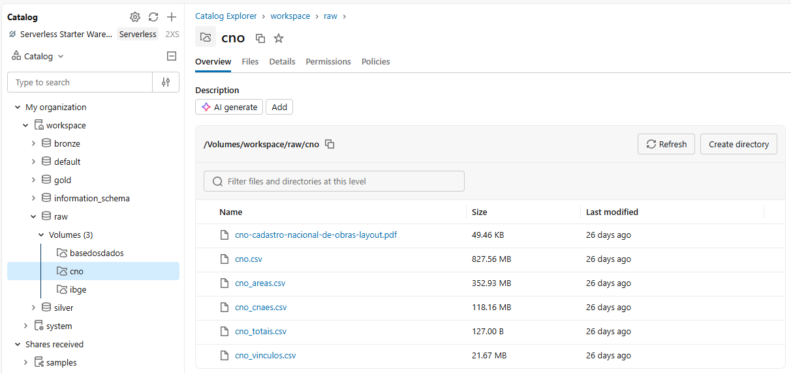
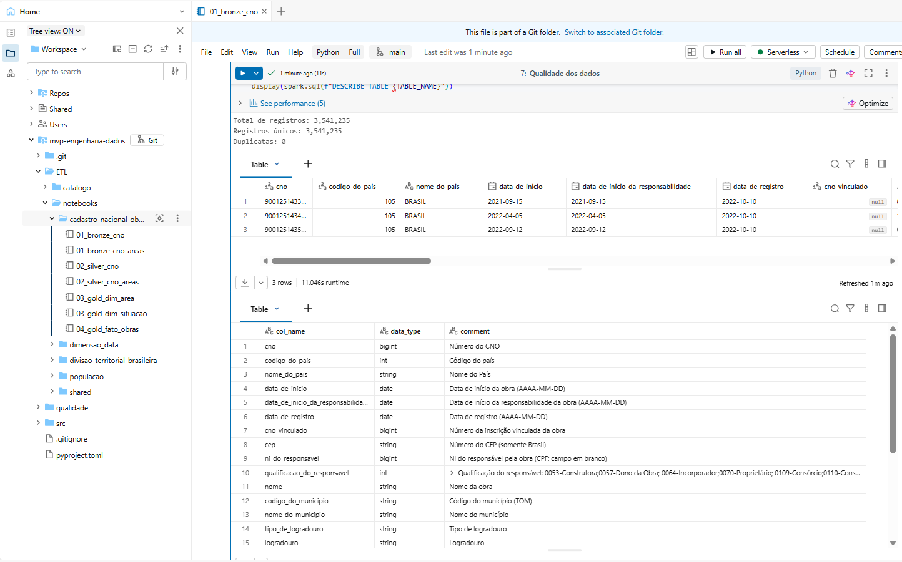
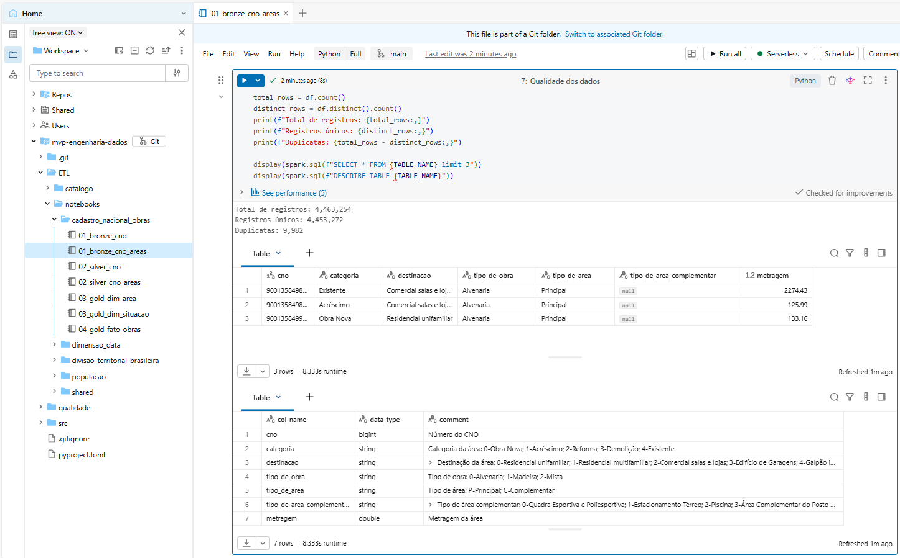
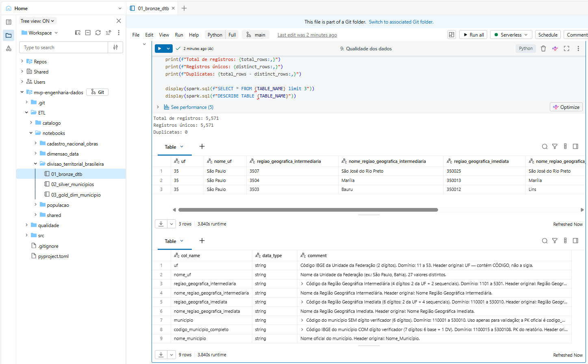
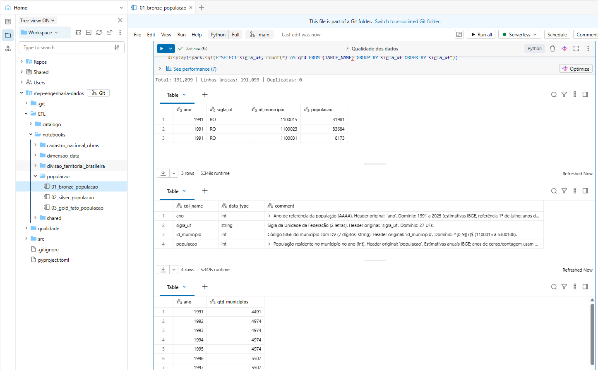

# Carga dos Dados (Etapa 4.2) — Coleta

> Documento principal do tópico **"Carga dos Dados"**.
> Detalhamento da origem de cada fonte: [Origem dos dados](fontes.md)

---

## Método de coleta

A coleta foi feita de forma **manual** (download + upload para o Databricks), sem automatização:

1. **Download** do arquivo bruto na fonte oficial (CSV/ODS);
2. **Upload manual** do arquivo para o Volume no Databricks (`/Volumes/workspace/raw/<dominio>/`);
3. **Ingestão** para a camada bronze pelos notebooks (`read_csv`/`read_ods` → `workspace.bronze.*`, Delta).

Limitação importante: 

- Exceto pelos próprios arquivos de dados, não foi encontrada documentação de API que permita automatizar a disponibilização/coleta desses dados.
- O CNO é baixado por uma URL a partir do portal de dados abertos, mas não há indicação se essa URL é fixa/estável.

## Fontes (resumo)

| Dado | Fonte / URL | Arquivo coletado | Licença | Atualização |
|---|---|---|---|---|
| CNO — obras | [dados.gov.br](https://dados.gov.br/dados/conjuntos-dados/cadastro-nacional-de-obras-cno) | `cno.csv` | Creative Commons Attribution (RFB) | Diária |
| CNO — áreas | [dados.gov.br](https://dados.gov.br/dados/conjuntos-dados/cadastro-nacional-de-obras-cno) | `cno_areas.csv` | Creative Commons Attribution (RFB) | Diária |
| DTB — Divisão Territorial | [IBGE](https://www.ibge.gov.br/geociencias/organizacao-do-territorio/estrutura-territorial/23701-divisao-territorial-brasileira.html) (FTP `geoftp.ibge.gov.br`) | `RELATORIO_DTB_BRASIL_2025_MUNICIPIOS.ods` (extraído de `DTB_2025.zip`) | Dados públicos IBGE (citar fonte) | Anual |
| População por município | [Base dos Dados](https://basedosdados.org/dataset/d30222ad-7a5c-4778-a1ec-f0785371d1ca?table=0c279444-165b-41da-92cd-50fd7e66baa1) | `br_ibge_populacao_municipio.csv` | CC-BY-4.0 | Anual |

> Detalhes (como foi coletado cada um, formato, encoding, estrutura do arquivo e notas): [Origem dos dados](fontes.md).

## Persistência na nuvem

- **Raw (Volume):** `/Volumes/workspace/raw/cno/`, `/Volumes/workspace/raw/IBGE/`, `/Volumes/workspace/raw/basedosdados/`.
- **Bronze (Delta):** `workspace.bronze.cno`, `workspace.bronze.cno_areas`, `workspace.bronze.dtb`, `workspace.bronze.estimativa_populacional`.

## Evidências

| Etapa | Evidência |
|---|---|
| Arquivos raw no Volume |  |
| Bronze CNO |  |
| Bronze CNO áreas |  |
| Bronze DTB |  |
| Bronze População |  |