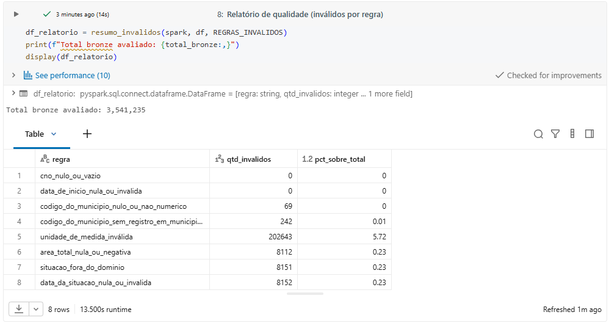
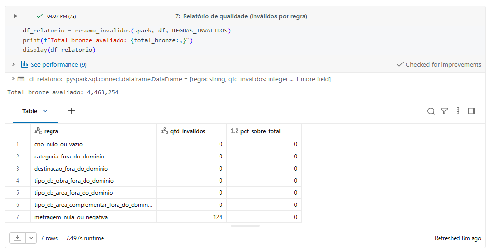
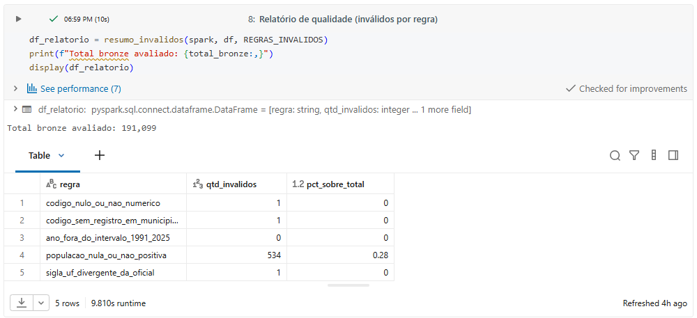
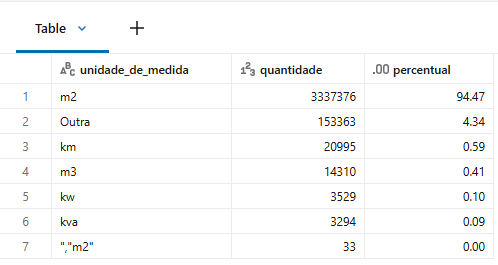
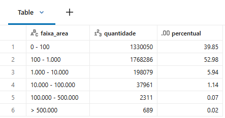
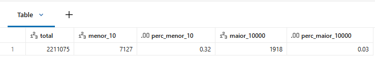
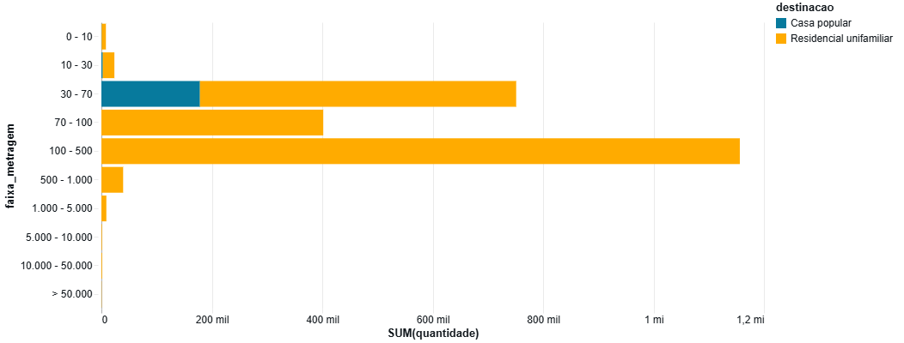

# Qualidade de Dados (Etapa 4.5)

> Documento principal do tópico **"Qualidade de Dados"**.
> Análise executada no notebook [`qualidade/cadastro_nacional_obras.ipynb`](../../qualidade/cadastro_nacional_obras.ipynb).

---

## Abordagem

A qualidade foi tratada em duas frentes:

1. **Regras na camada silver** — cada transformação aplica regras de invalidade contabilizadas em relatório (`resumo_invalidos`): nulos, formatos, domínios, unicidade. Registros inválidos são descartados e o impacto é documentado.
2. **Análise por atributo** — exploração específica dos atributos críticos (`unidade_de_medida`, `area_total`, `metragem`) para decidir tratamentos e identificar limitações.

## Registros inválidos removidos (silver)

| Fonte | Evidência |
|---|---|
| CNO (obras) — inválidos por regra e remoção |  |
| CNO (áreas) — inválidos por regra e remoção |  |
| População — inválidos por regra e remoção |  |

## Análise por atributo

### `unidade_de_medida`

- Foram encontradas **apenas `m2` como unidade válida**.
- **Nota:** o arquivo CSV da RFB contém o literal `m2` (sem o caractere `²`). A regra de validação na camada silver compara a string exata `m2`; ocorrências como `m²` (se houvesse) também seriam descartadas por não casarem com o valor canônico da fonte.
- Ocorrências inconsistentes: `km` (provavelmente `km²`) e `,m2` (erro de digitação).
- **Decisão:** descartar essas ocorrências na camada silver, **sem correção automática** (quantidade baixa e ausência de evidência suficiente para a unidade correta).

### `area_total`

- A distribuição por faixas não permite definir um **limite superior confiável** para remoção.
- Valores acima de `500.000 m²` são raros (0,02%), mas o CNO contempla obras legítimas de grande porte (conjuntos habitacionais, garagens, etc.).
- **Decisão:** nenhum registro removido com base no limite superior; os extremos são mantidos para análise conjunta com outras informações.

### `metragem` (casas — residencial unifamiliar e casa popular)

- Maior concentração na faixa de **100 a 500 m²**.
- Baixa representatividade de construções **< 70 m²**, coerente com a **dispensa legal de registro** para residências unifamiliares de até 70 m² sem mão de obra remunerada.
- **Consequência:** sub-representação de pequenas construções — a distribuição observada não representa necessariamente a realidade.

## Conclusão

Os problemas detectados foram tratados na camada silver (regras por atributo, descarte de inválidos e unidades fora de `m2`). A principal **limitação de qualidade é a sub-representação de construções menores de 70 m²**, que afeta diretamente a interpretação das respostas do objetivo (ver [Análise de Dados](../analise-de-dados/README.md)).

## Notebook (evidência de execução)

| Notebook | Código (.ipynb) | Execução (.html) |
|---|---|---|
| `cadastro_nacional_obras` (qualidade) | [ipynb](https://github.com/leobarduzzi/mvp-engenharia-dados/blob/main/qualidade/cadastro_nacional_obras.ipynb) | [html](https://leobarduzzi.github.io/mvp-engenharia-dados/notebooks/qualidade_cadastro_nacional_obras.html) |